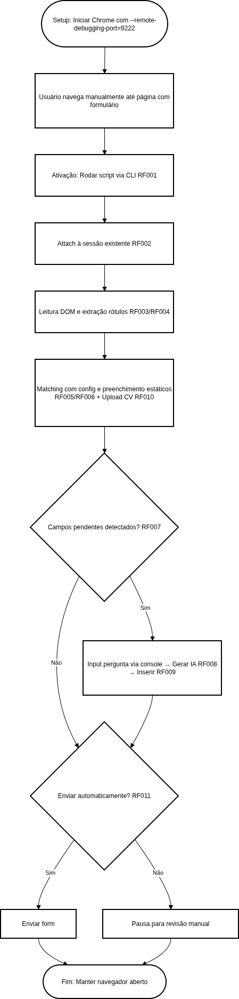

# Especificação de Requisitos de Software (SRS) - Projeto Preencher-Vaga

Este documento segue as diretrizes da norma **IEEE 830-1998** para especificação de requisitos de software, adaptado para um fluxo ágil inspirado em Scrum.

## 1. Introdução
### 1.1 Propósito
Este SRS descreve os requisitos para um script Python simples que automatiza o preenchimento de formulários de candidaturas a vagas de emprego em sites como LinkedIn, Indeed, InfoJobs ou Glassdoor. O sistema permite ativação on-demand durante a navegação manual no navegador, conectando-se a uma sessão existente para preencher campos detectados em formulários, sem depender de APIs pagas. Rodando localmente, gratuito e offline após setup.

### 1.2 Escopo
O MVP foca em attach a um navegador Chrome existente (via remote debugging port), mapeamento dinâmico de DOM para formulários, preenchimento automático de campos comuns, upload de CV e geração de respostas personalizadas via IA local (Ollama). Não inclui hotkeys ou extensões de navegador no MVP; ativação via CLI. Expansões futuras: suporte a hotkeys ou mais navegadores.

### 1.3 Definições e Acrônimos
- CLI: Command Line Interface
- DOM: Document Object Model
- LLM: Large Language Model (ex.: Llama3 via Ollama)
- MoSCoW: Must-have (obrigatório), Should-have (importante), Could-have (desejável), Won't-have (fora do escopo)
- MVP: Minimum Viable Product
- RF: Requisito Funcional
- RNF: Requisito Não-Funcional

## 2. Descrição Geral
### 2.1 Perspectiva do Produto
O 'Preencher-Vaga' permite que candidatos a empregos naveguem normalmente em sites de vagas e, ao encontrar um formulário, ativem o script para automação, simulando ações humanas e mantendo privacidade (processamento local). Isso melhora a usabilidade em comparação a scripts que exigem URLs fixas.

### 2.2 Funções do Produto
O usuário inicia o navegador com uma flag de debugging, navega até uma página com formulário, ativa o script via CLI, que se conecta à sessão, mapeia campos, preenche dados estáticos, usa IA para respostas dissertativas e oferece envio opcional.

### 2.3 User Stories Priorizadas (com MoSCoW)
- **Must-have:**
  - Como usuário, quero ativar o script durante a navegação manual para preencher automaticamente formulários na aba atual do navegador existente, sem abrir uma nova instância.
  - Como usuário, quero armazenar minhas informações pessoais (nome, email, telefone, endereço, experiências, habilidades, path do CV) em um arquivo de configuração para preenchimento automático de campos comuns.
  - Como usuário, quero upload automático do CV em campos de arquivo.
  - Como usuário, para perguntas específicas em textareas (ex.: 'Por que você quer essa vaga?'), o script deve detectar o campo, pausar para eu inputar a pergunta exata via console, gerar uma resposta personalizada usando Ollama (LLM local como Llama3) incorporando minhas infos pessoais, e inserir a resposta no campo.
  - Como usuário, quero opção de envio automático do form ou pausa para revisão manual.
- **Should-have:**
  - Suporte básico a múltiplos sites via selectors adaptáveis.
- **Could-have:**
  - Modo headless para testes (se compatível com attach).
- **Won't-have:**
  - Hotkeys ou GUI para ativação; login automático; suporte a outros navegadores além do Chrome.

### 2.4 Restrições
- Dependências: Python 3.10+, selenium, webdriver-manager, ollama.
- Foco em simplicidade com try/except para erros; rodar offline após setup inicial.

## 3. Requisitos Específicos
### 3.1 Requisitos Funcionais (RF)
Cada RF inclui critérios de aceitação para testabilidade.
* **[RF001] Ativação via Comando:** O sistema deve ser ativado via CLI para conectar-se ao navegador existente e iniciar o ciclo de preenchimento. *Critério:* Aceita ativação simples (ex.: python preencher_vaga.py) e processa a página atual.
* **[RF002] Attach a Sessão Existente:** O sistema deve conectar ao Chrome rodando com --remote-debugging-port=9222, sem iniciar uma nova instância. *Critério:* Usa debugger_address para attach; mantém a sessão aberta após execução.
* **[RF003] Leitura de DOM:** O sistema deve realizar o mapeamento do DOM da página atual para localizar elementos de formulário (<form>). *Critério:* Detecta forms dinamicamente com Selenium, adicionando delays random (1-5s) para simular ações humanas.
* **[RF004] Extração de Rótulos:** O sistema deve extrair o texto de etiquetas (<label>) e atributos de acessibilidade dos campos identificados. *Critério:* Armazena rótulos para matching preciso.
* **[RF005] Consulta de Base Local:** O sistema deve realizar o matching entre os rótulos encontrados e os dados armazenados no arquivo de configuração local (config.py). *Critério:* Usa dict para infos pessoais, com suporte a variações de rótulos.
* **[RF006] Preenchimento de Dados Estáticos:** O sistema deve inserir automaticamente informações como nome, e-mail, telefone e endereço caso existam na base local. *Critério:* Suporte a selectors adaptáveis para múltiplos sites; try/except para campos não encontrados.
* **[RF007] Isolamento de Pendências:** O sistema deve identificar campos sem correspondência local (ex.: textareas dissertativas) para processamento via IA. *Critério:* Pausa para input da pergunta exata via console se detectado.
* **[RF008] Integração com Ollama (IA Local):** O sistema deve enviar o contexto do usuário (infos pessoais) e a pergunta do formulário para o modelo Ollama local (Llama3). *Critério:* Prompt em inglês para respostas profissionais e personalizadas (<200 palavras).
* **[RF009] Inserção de Respostas de IA:** O sistema deve capturar a saída da IA e preencher os campos dissertativos correspondentes. *Critério:* Insere com delays e try/except para erros de geração.
* **[RF010] Gestão de Arquivos:** O sistema deve realizar o upload do currículo (PDF/DOCX) a partir do caminho especificado na configuração. *Critério:* Usa send_keys em input[type="file"] detectados no form.
* **[RF011] Opção de Envio:** O sistema deve oferecer envio automático do form ou pausa para revisão manual. *Critério:* Procura button[type="submit"] no form detectado e pergunta via console (s/n).

### 3.2 Requisitos Não-Funcionais (RNF)
* **[RNF001] Ambiente de Execução:** O sistema deve ser compatível com sistemas operacionais comuns (Ubuntu, Windows, macOS), usando Python portátil e Chrome como navegador.
* **[RNF002] Privacidade de Dados:** Todo o processamento de IA deve ser local (Ollama), sem envio de dados pessoais para nuvens externas.
* **[RNF003] Desempenho:** O tempo de resposta da IA para cada campo não deve exceder 30 segundos; delays random para todas as ações para evitar detecção como bot.
* **[RNF004] Portabilidade:** O projeto deve ser estruturado em Python utilizando ambientes virtuais (venv) e requirements.txt para dependências.
* **[RNF005] Robustez:** Incluir try/except para erros de attach, rede, Selenium ou IA; rodar offline após setup.
* **[RNF006] Configuração Inicial:** O usuário deve configurar o navegador com flag de debugging (--remote-debugging-port=9222) para enable attach.

### 3.3 Diagrama de Fluxo Simples
